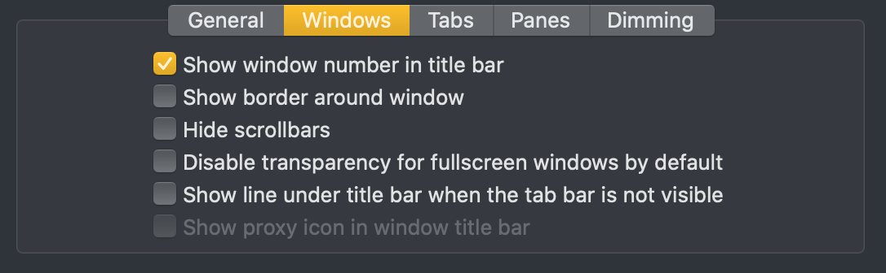

# Roberto's OSX terminal config #
 
   
  

This configuration is **heavily** based on [this](https://medium.com/@Clovis_app/configuration-of-a-beautiful-efficient-terminal-and-prompt-on-osx-in-7-minutes-827c29391961)
Medium configuration walkthrough.     

## Components   
### Core
* [iTerm2](https://www.iterm2.com/)  
* [oh-my-zsh](https://ohmyz.sh/)  
* [ranger](https://github.com/ranger/ranger)     
* [ksh](https://en.wikipedia.org/wiki/KornShell)

### Addons
* [vtop](https://github.com/MrRio/vtop)
* [shpotify](https://github.com/hnarayanan/shpotify)   
* [Übersicht](http://tracesof.net/uebersicht/)    
* [Archey](https://github.com/obihann/archey-osx)

## Installation ##
### Core
1. Install iTerm2   
`brew cask install iterm2`   

2. Configure iTerm2    
  i. Install [Meslo Powerline Font](https://github.com/powerline/fonts/blob/master/Meslo%20Slashed/Meslo%20LG%20M%20Regular%20for%20Powerline.ttf). 
Click view Raw to download the font. (In OSX when you open it it should add it to your Font Book).    
  ii. In Preferences - Profile Import the profile located under iTermProfile folder in the repo.     
  iii. In Preferences - Appearence - Make sure your settings look like this:   

   

3. Install ksh    
  `brew install ksh`   
4. Install oh-my-zsh    
  `brew install zsh zsh-completions`     
  `sh -c "$(curl -fsSL https://raw.github.com/robbyrussell/oh-my-zsh/master/tools/install.sh)"`   
5. Replace .zshrc   
  `rm ~/.zshrc`   
  `ln ~/config/zshrc ~/.zshrc`   
6. If you want ranger to preview images look at instructions [here](https://github.com/ranger/ranger/wiki/Image-Previews) (Please note the image rendering is very slow may not be worth the trouble).

### Addons
1. Install vtop `sudo npm install -g vtop`
2. Install shpotify `brew install shpotify`
3. Install Übersicht [here](http://tracesof.net/uebersicht/)
4. Clone pecan to where Übersicht keeps its widgets. In macos `git clone https://github.com/zzzeyez/pecan.git ~/Library/Application\ Support/Übersicht/widgets/pecan`
5. Install archey `brew install archey`

___

[Roberto](https://robertoodogherty.github.io/) 03/2020

