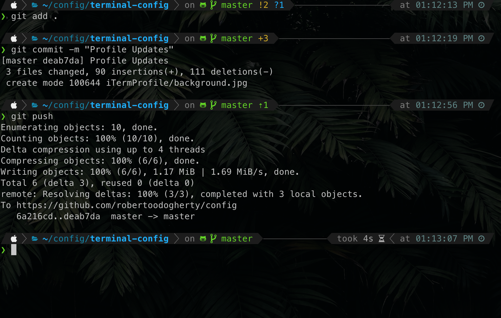

# Roberto's OSX terminal config #

 
## Components   
### Core
* [iTerm2](https://www.iterm2.com/)  
* [oh-my-zsh](https://ohmyz.sh/)  
* [ksh](https://en.wikipedia.org/wiki/KornShell)

## Installation ##
### Core
1. Install iTerm2   
`brew cask install iterm2`   

2. Configure iTerm2    
  i. Install [Meslo Powerline Font](https://github.com/powerline/fonts/blob/master/Meslo%20Slashed/Meslo%20LG%20M%20Regular%20for%20Powerline.ttf). 
Click view Raw to download the font. (In OSX when you open it it should add it to your Font Book).    
  ii. In Preferences - Profile Import the profile located under iTermProfile folder in the repo.     
  iii. In Preferences - Appearence - Make sure your settings look like this:   

   

3. Install ksh    
  `brew install ksh`   
4. Install oh-my-zsh    
  `brew install zsh zsh-completions`     
  `sh -c "$(curl -fsSL https://raw.github.com/robbyrussell/oh-my-zsh/master/tools/install.sh)"`   
5. [Install Powerlevel 10k](https://github.com/romkatv/powerlevel10k#manual)   
6. Run `p10k configure`    
7. At the bottom of the `~/.zshrc` file add `. <location of alias.sh file>`

___

[Roberto](https://robertoodogherty.github.io/) 03/2020

